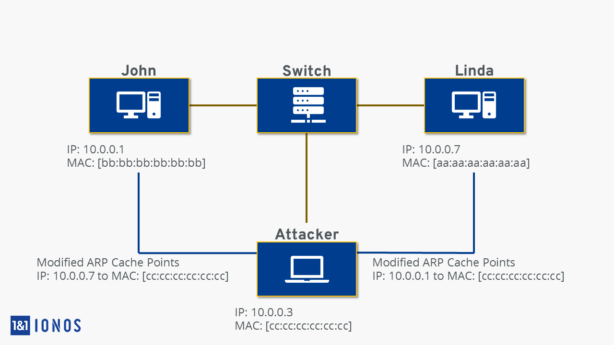
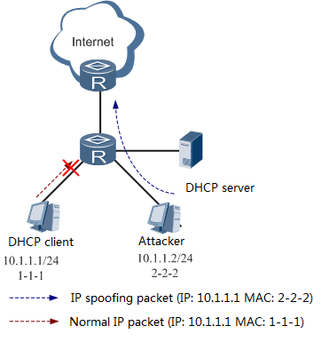
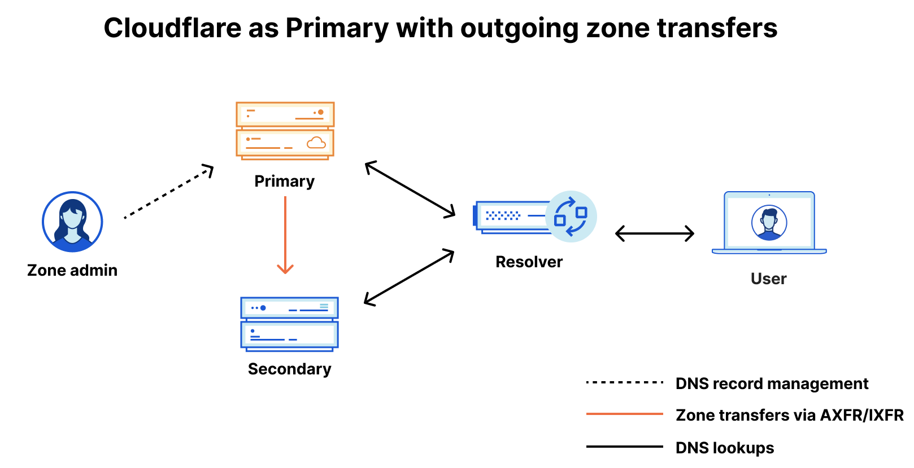

```{r setup, include=FALSE}
library(knitr)
knitr::opts_chunk$set(tidy.opts = list(width.cutoff = 60), tidy = TRUE)
```

# `whoami`

```{r, echo=FALSE, fig.show="hold", fig.align='center', out.width = "20%"}
include_graphics("images/esilv.png")
include_graphics("images/davincicode.png")
```

- Clovis
- A5 IOS
- Co-Founder and VP of DaVinciCode

# Network

- OSI Model?
- Addresses???
- ARP, DNS, DHCP, DNS??????


# OSI Model
```{r, echo=FALSE, fig.show="hold", fig.align='center', out.width = "60%"}
include_graphics("images/osi.jpeg")
```


# Wireshark

- Most used tool to:
  - Capture packet
  - Display network captures (-> Often very useful in Forensics!)

- Example: IP addr (Layer 3), MAC addr (Layer 2) + Network interfaces\
\
```bash
ip a
```


# ARP

- Link between layer 2 and 3: assign a MAC to an IP

```bash
arp -a
arp -d 
arp -a
```


- Vulnerable to ARP Cache Poisoning (MiTM):

```{r, echo=FALSE, fig.show="hold", fig.align='center', out.width = "50%"}

```


# ARP

- Another common spoofing attack: MAC Poisoning	

Poison the ARP table of the router to spoof with the attacker MAC address of a legitimate connection.

```{r, echo=FALSE, fig.show="hold", fig.align='center', out.width = "35%"}

```


# Application Layer

## DHCP

- Dynamic Host Configuration Protocol

- Gives IP to client on a network

Can be done manually:

```bash
#Create a network interface
ifconfig eth0 192.168.43.226
ifconfig eth0 netmask 255.255.255.0
ifconfig eth0 broadcast 192.168.43.255
#Add it to routes
route add default gw 192.168.43.1 eth0
```

# Application Layer

## DNS

- Domain Name System
- Often public and managed by big company (Google: 8.8.8.8 and 8.8.4.4), manually added to: ``/etc/resolv.conf``
- Assign an IP to a domain name

```bash
nslookup -type=txt dvc.tf 8.8.8.8
dig @8.8.8.8 dvc.tf TXT
```

- Record DNS: ANY, A, TXT...


# DNS Spoofing/Cache poisonning/Hijacking

```{r, echo=FALSE, fig.show="hold", fig.align='center', out.width = "80%"}
include_graphics("images/DNS-spoofing.jpg")
```


# DNS Zone transfers:
```{r, echo=FALSE, fig.show="hold", fig.align='center', out.width = "60%"}

```

```bash
dig axfr @$(DNS_IP) $(DOMAIN.COM)
```


# Recon

## Nmap

Full in depth port scan

```bash
sudo nmap nmap -SCV -vv -oA box $(cat ip)
# Add -sT (TCP Connect) to avoid firewall flagging you as a bot who
# only does 2 step of tcp handshakes
```

Full port scan

```bash
sudo nmap -p- -v -oA box_allports $(cat ip) 
# add --min-rate 1000/10000 if needed
```


UDP port scan:

```bash
sudo nmap -sU -oA box_udp $(ip)
```

# Recon

## sTTL

```bash
ping $(ip)
# ttl<127 	=> Windows
# ttl<64 	=> Linux, BSD, IoT...
# ttl<256 	=> Network infrastructure, like a cisco router
```

## Subdomain enumeration

```bash
gobuster vhost -u https://dvc.tf -w /opt/SecLists/Discovery/DNS/subdomains 
# For subdomains discovery as sub.domain.htb
```