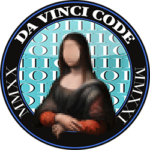

# Crypto101 Express 🚂🗝

Cours de Linux proposé par DaVinciCode, [l'association de cybersécurité](https://digiteamdevinci.com/) de l'[École supérieure d'ingénieurs Léonard-de-Vinci](https://www.esilv.fr/). 

## Liens vers les slides

- [Introduction](https://github.com/DaVinciCodeCTF/linux101-express/raw/master/introduction/introduction.pdf)
