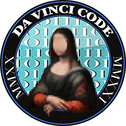

# Masterclass DaVinciCode

Cours proposé par DaVinciCode, [l'association de cybersécurité](https://davincicode.fr/) de l'[École supérieure d'ingénieurs Léonard-de-Vinci](https://www.esilv.fr/).

## > Présentations 2025 - 2026

- ### Cybersecurity 101 : Introduction à la cybersécurité 🚸

Introduction à la cybersécurité, Linux, distros, bash, catégories en CTF, ...

Documents : [Support de présentation](https://github.com/DaVinciCodeCTF/masterclass/tree/master/2025/Cybersecurite_Bases)

REPLAY (DVHE seulement) : [replay](https://devinci.sharepoint.com/sites/DavincicodeBureau2022-2023-PleEvnementiel_/_layouts/15/guestaccess.aspx?share=IQBkYBcWoEX_TKjh5q4dCxLfAU5-6WBPPB37Kzd7GZmdPaI&e=wwRlib)

IMAGE : [IMAGE](https://raw.githubusercontent.com/DaVinciCodeCTF/masterclass/master/2025/Cybersecurite_Bases/Cybersecurite_Bases.png)

- ### Bases réseau 🛜

Concepts de base en réseau, encodage, modulation, adressage, équipements, ...

Documents : [Support de présentation](https://github.com/DaVinciCodeCTF/masterclass/tree/master/2025/Reseau_Bases)

REPLAY (DVHE seulement) : [replay](https://devinci.sharepoint.com/sites/DavincicodeBureau2022-2023-PleEvnementiel_/_layouts/15/guestaccess.aspx?share=IQA68gD7S72NRbU-YJ-ipYwPASOzuoSpQ6FCXiRwHL4RZTs&e=aeAEHa)

IMAGE : [IMAGE](https://raw.githubusercontent.com/DaVinciCodeCTF/masterclass/master/2025/Reseau_Bases/Reseau_Bases.png)

- ### OWASP Top 10

Sécurité Web, OWASP Top 10 et vulnérabilités communes : IDOR, File Upload, XSS, SQL Injection

Documents : [Support de présentation](https://github.com/DaVinciCodeCTF/masterclass/tree/master/2025/Web)

REPLAY (DVHE seulement) : [replay](https://devinci.sharepoint.com/sites/DavincicodeBureau2022-2023-PleEvnementiel_/_layouts/15/guestaccess.aspx?share=IQBXFeF5CbqcQrWUzQ8e0cO4ASCqB6cWQw422rp_Y8nD4gM&e=oLbSW1)

IMAGE : [IMAGE](https://raw.githubusercontent.com/DaVinciCodeCTF/masterclass/master/2025/Web/Web.png)

- ### Les bases de Python

Cours sur Python, ressources web, requests, pwntools.

Documents : [Site web](http://paracetamole.site:3000/)

REPLAY (DVHE seulement) : [replay](https://devinci.sharepoint.com/sites/DavincicodeBureau2022-2023-PleEvnementiel_/_layouts/15/guestaccess.aspx?share=IQDfgyx3f7jkQq_ue3BysaNmAZzKG4LOkEqDSpwDkDdnT7E&e=ndCztV)

IMAGE : [IMAGE](https://raw.githubusercontent.com/DaVinciCodeCTF/masterclass/master/2025/Python/Python.png)

- ### Cryptographie

Cours sur la cryptographie.

Documents : **Pas de documents**

REPLAY (DVHE seulement) : [replay](https://devinci.sharepoint.com/sites/DavincicodeBureau2022-2023-PleEvnementiel_/_layouts/15/guestaccess.aspx?share=IQDmyWICQ7nMQag6jdOhxHyxAfJyVYR-pxAzhdzhzN-gOx4&e=oyZJ3r)

IMAGE : [IMAGE](https://raw.githubusercontent.com/DaVinciCodeCTF/masterclass/master/2025/Cryptographie/Cryptographie.png)

- ### Réseau Avancé 🛜

Concepts plus avancés en réseau : VPN, Firewall, Tunneling, DNS, ...

Documents : [Support de présentation](https://github.com/DaVinciCodeCTF/masterclass/tree/master/2025/Reseau_Avance)

REPLAY (DVHE seulement) : [replay](https://devinci.sharepoint.com/sites/DavincicodeBureau2022-2023-PleEvnementiel_/_layouts/15/guestaccess.aspx?share=IQDLhO-wSINKRZkH6NcTDorbASQneGy8wHo_quhkP_m0Las&e=dufgTw)

IMAGE : [IMAGE](https://raw.githubusercontent.com/DaVinciCodeCTF/masterclass/master/2025/Reseau_Avance/Reseau_Avance.png)

## > Présentations 2024 - 2025

- ### Python For CTF  🐍

Cours de présentation de l'utilisation de Python pour les CTF avec des exercices pratiques.

Documents : [Support de présentation](https://github.com/DaVinciCodeCTF/masterclass/tree/master/2025/Python)

REPLAY (DVHE seulement) :  **Pas de replays**

IMAGE : [IMAGE](https://raw.githubusercontent.com/DaVinciCodeCTF/masterclass/master/2025/Python/Python.png)

- ### Reverse Engineering For CTF 🌀

Cours de présentation des bases théoriques des architectures systèmes, des outils et principes du reverse engineering Python pour les CTF avec une mise en pratique sur RootMe.

Documents : **Pas de documents**

REPLAY (DVHE seulement) : [replay](https://devinci.sharepoint.com/sites/DavincicodeBureau2022-2023-PleEvnementiel_/_layouts/15/guestaccess.aspx?share=EW2K3az9EhBAjTJhnPX6a5QBWOuiQJYStXUZeGs-nvG4bw&e=SsHXy2)

IMAGE : [IMAGE](https://raw.githubusercontent.com/DaVinciCodeCTF/masterclass/master/2025/Reverse/Reverse.png)

- ### EXT : OSINT 🌍

Cours et présentation sur l'OSINT par un intervenant externe, avec un exercice.

Documents : **Pas de documents**

REPLAY (DVHE seulement) : **Pas de replays**

- ### Forensic Level 1 🔨

Cours de présentation de l'analyse forensique pour les débutants, avec plusieurs exercices.

Documents : [Exercices + Support de présentation](https://github.com/DaVinciCodeCTF/masterclass/tree/master/2025/Forensic_Level_1)

REPLAY (DVHE seulement) : [replay](https://devinci.sharepoint.com/sites/DavincicodeBureau2022-2023-PleEvnementiel_/_layouts/15/guestaccess.aspx?share=EVFiAEhni0lLmDJLU7UgYBMB26KfgL3QQinr4lG35x-fEA&e=52bkFd)

IMAGE : [IMAGE](https://raw.githubusercontent.com/DaVinciCodeCTF/masterclass/master/2025/Forensic_Level_1/Forensic_Level_1.png)

- ### Forensic Level 2 ✂️

Cours de présentation de l'analyse forensique avancée, avec plusieurs exercices.

Documents : [Exercices + Support de présentation](https://github.com/DaVinciCodeCTF/masterclass/tree/master/2025/Forensic_Level_2)

REPLAY (DVHE seulement) : [replay](https://devinci.sharepoint.com/sites/DavincicodeBureau2022-2023-PleEvnementiel_/_layouts/15/guestaccess.aspx?share=EW7BoQit5rBLuP0R2pO1-OsBBFpHzBf4BHCS-Wp4a6cTQw&e=rkhttm)

IMAGE : [IMAGE](https://raw.githubusercontent.com/DaVinciCodeCTF/masterclass/master/2025/Forensic_Level_2/Forensic_Level_2.png)

-  ### EXT : Radio fréquences et HackRF 📡

Introduction aux radios fréquences et travaux pratiques utilisant le HackRF One.

Documents : **Pas de documents**

REPLAY (DVHE seulement) : [replay](https://devinci.sharepoint.com/sites/DavincicodeBureau2022-2023-PleEvnementiel_/_layouts/15/guestaccess.aspx?share=EYiDFZyRUxNEjEdiFqQSEIUBuiCrDF224MTsTU0Ss88-BA&e=7RLQxp)

- ### EXT : RETEX & Cadenas Bluetooth 🔐

Présentation d'un parcours féminin dans la cybersécurité et partage des travaux réalisés sur le hacking d'un cadenas Bluetooth.

Documents : [Support de présentation](https://github.com/DaVinciCodeCTF/masterclass/tree/master/2025/EXT_RETEX_Bluetooth)

REPLAY (DVHE seulement) : [replay](https://devinci.sharepoint.com/sites/DavincicodeBureau2022-2023-PleEvnementiel_/_layouts/15/guestaccess.aspx?share=EZrcnfhRQTtIn2SiEzpNtWkBmnnwP73CdbxMkgy6hRGZKA&e=DBt6VJ)

IMAGE : [IMAGE](https://raw.githubusercontent.com/DaVinciCodeCTF/masterclass/master/2025/EXT_RETEX_Bluetooth/EXT_RETEX_Bluetooth.png)

- ### Active Directory et GOAD 👑

Cours complet sur l'Active Directory et expérimentations sur l'infrastructure de l'association avec GOAD.

Documents : [Support de présentation](https://github.com/DaVinciCodeCTF/masterclass/tree/master/2025/Active_Directory)

REPLAY (DVHE seulement) : [replay](https://devinci.sharepoint.com/sites/DavincicodeBureau2022-2023-PleEvnementiel_/_layouts/15/guestaccess.aspx?share=EUQ83FX5A-tDtJNB1UwrTR0B5VOw3ePjj6z1K5W3Q9UdKw&e=1TdpdS)

IMAGE : [IMAGE](https://raw.githubusercontent.com/DaVinciCodeCTF/masterclass/master/2025/Active_Directory/Active_Directory.png)

- ### ⌛ Pwn niveau 0 🏆

Introduction au PWN et exercices pratiques.

Documents : [Exercices + Support de présentation](https://github.com/DaVinciCodeCTF/masterclass/tree/master/2025/Pwn)

REPLAY (DVHE seulement) : [replay 🏗️]()

- ### ⌛ Cryptographie 🗝️

Introduction à la cryptographie et exercices pratiques.

REPLAY (DVHE seulement) : [replay 🏗️]()

## > Présentations 2022 - 2023

- ### Linux101 Express 🚂🐧

Cours sur les bases de Linux.

Documents : [Exercices + Support de présentation](https://github.com/DaVinciCodeCTF/masterclass/tree/master/2022/linux101)

IMAGE : [IMAGE](https://raw.githubusercontent.com/DaVinciCodeCTF/masterclass/master/2022/linux101/linux101.png)

- ### Network And Recon 🌐 🔭 

Cours sur les bases en réseaux et reconaissance.

Documents : [Exercices + Support de présentation](https://github.com/DaVinciCodeCTF/masterclass/tree/master/2022/network_and_recon)

IMAGE : [IMAGE](https://raw.githubusercontent.com/DaVinciCodeCTF/masterclass/master/2022/network_and_recon/network_and_recon.png)

- ### NMAP 👀

Cours sur les bases de la reconnaissance avec NMAP.

Documents : [Support de présentation](https://github.com/DaVinciCodeCTF/masterclass/tree/master/2022/nmap)

IMAGE : [IMAGE](https://raw.githubusercontent.com/DaVinciCodeCTF/masterclass/master/2022/nmap/nmap.png)

- ### R3G3X 🔍

Cours sur l'utilisation des expressions régulières.

Documents : [Exercices + Support de présentation](https://github.com/DaVinciCodeCTF/masterclass/tree/master/2022/r3g3x)

IMAGE : [IMAGE](https://raw.githubusercontent.com/DaVinciCodeCTF/masterclass/master/2022/r3g3x/r3g3x.png)

- ### Steganography 🎨

Cours et outils sur la séganographie en CTF.

Documents : [Exercices + Support de présentation](https://github.com/DaVinciCodeCTF/masterclass/tree/master/2022/stega)

IMAGE : [IMAGE](https://raw.githubusercontent.com/DaVinciCodeCTF/masterclass/master/2022/stega/stega.png)

## >  Présentations 2021 - 2022

  - ### Python For CTF 🐍 🚩

Cours sur l'utilisation de Python en CTF.

Documents : [Exercices + Support de présentation](https://github.com/DaVinciCodeCTF/masterclass/tree/master/2021/python_for_ctf)

IMAGE : [IMAGE](https://raw.githubusercontent.com/DaVinciCodeCTF/masterclass/master/2021/python_for_ctf/python_for_ctf.png)

  - ### Forensics Handbook For CTF 🔬 📖 

Cours sur l'analyse forensique et les outils utilisés pendant en CTF.

Documents : [Exercices + Support de présentation](https://github.com/DaVinciCodeCTF/masterclass/tree/master/2021/forensics_ctf_handbook)

IMAGE : [IMAGE](https://raw.githubusercontent.com/DaVinciCodeCTF/masterclass/master/2021/forensics_ctf_handbook/forensics_ctf_handbook.png)
